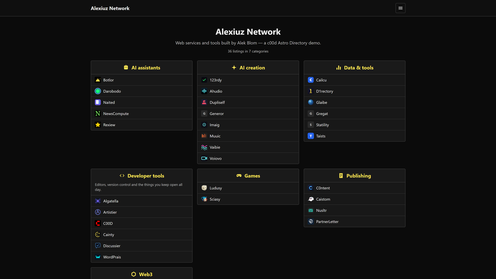

# c00d Astro Directory

A ranked link directory as a static Astro site. Category boxes of listings with
ratings, per-category pages, detail pages, and client-side search.

Ships with local JSON content so it works the moment you clone it — and can
instead build from a live [c00d Directory](https://c00d.com/templates/c00d-directory)
API, which is where it gets interesting.

MIT licensed. **[Live demo](https://c00d.com/demo/astro-dir/)** — that one is built
against a live API, so it shows the second mode below.



## Quick start

```bash
npx degit alekblom/c00d-astro-directory my-directory
cd my-directory
npm install
npm run dev
```

Edit the JSON under `src/content/listings/` and `src/content/categories/`,
then `npm run build`. Deploy `dist/` anywhere — Netlify, Vercel, Cloudflare
Pages, GitHub Pages, a bucket.

## Two content modes

**Local JSON (default).** One file per listing and per category. Good for a
directory you curate yourself and redeploy when it changes.

**From a live API.** Set `DIRECTORY_API` and the content collections fetch at
build time instead:

```bash
DIRECTORY_API=https://example.com/your-directory npm run build
```

That points at a c00d Directory install with its JSON API switched on. You get
a static front end over a dataset that people can actually submit to, and
outbound links route through the directory's click counter rather than going
straight out.

Rebuild to publish changes. Wire it to a deploy hook if you want that automatic.

## What a static build cannot do

Worth being straight about, because a directory is a dynamic thing:

- **Submissions** need somewhere to write. Use the API mode, or point a form at
  a service like Formspree.
- **Click counting** needs a server. In API mode the directory counts them; in
  local mode links go straight out, which is the honest static behaviour.
- **Search** runs in the browser. The whole index ships as JSON — fine for a few
  hundred listings, a few kilobytes. Past a few thousand, move it to the API.

Everything else — browsing, categories, ratings, detail pages, sitemap, Open
Graph — is fully static.

## Content shape

`src/content/listings/example.json`:

```json
{
  "name": "Example",
  "slug": "example",
  "url": "https://example.com",
  "description": "One line about it.",
  "category": "tools",
  "rating": 9.1,
  "featured": false,
  "favicon": ""
}
```

`rating` may be `null`. Unrated listings still appear, sorted last — rather than
silently vanishing, which is what ordering by rating does if you are not careful.

`src/content/categories/tools.json`:

```json
{
  "name": "Tools",
  "slug": "tools",
  "description": "Things that do a job.",
  "icon": "",
  "order": 1
}
```

`icon` takes inline SVG. It is rendered as markup, so only put your own there.

## Configuring

- `src/consts.ts` — title, tagline, how many listings per box.
- `astro.config.mjs` — set `site` to your production URL before deploying, or
  canonical URLs and the sitemap will point at example.com.
- `src/styles/app.css` — the design tokens are the CSS variables at the top.
  This is the same stylesheet the PHP, WordPress and Joomla editions use, so a
  rebrand carries across all of them.

## Sibling editions

The same directory exists as a [PHP app](https://c00d.com/templates/c00d-directory),
a WordPress theme and a Joomla component, sharing this stylesheet and URL
structure (`/c/{category}`, `/l/{listing}`). Moving between them keeps your links.
